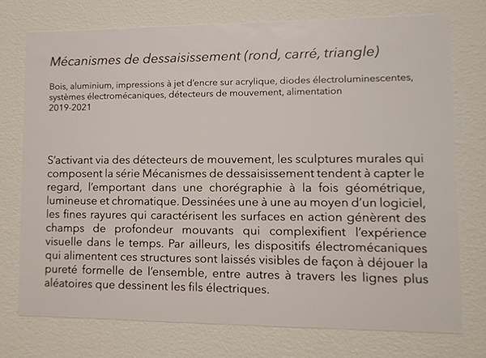

# Titre de l'oeuvre 

*Mécanismes de dessaisissement (rond, carré, triangle)*

# Nom de l'artiste

Catherine Béchard et Sabin Huidon

# Année de réalisation

2019-2020

# Nom de l'exposition

Béchard Hudon - Configurations du sensible

# Lieu de mise en exposition

Salle Alfred-Pellan

# Date de ma visite

16 mars 2022

# Description de l'oeuvre

S'activant via des détecteurs de mouvement, les sculptures murales qui composent la série Mécanismes de dessaisissement tendent à capter le regard, l'emportant dans une chorégraphie à la fois géométrique, lumineuse et chromatique. Dessinées une à une au moyen d'un logiciel, les fines rayures qui caractérisent les surfaces en action génèrent des champs de profondeur mouvants qui complexifient l'expérience visuelle dans le temps. Par ailleurs, les dispositifs électromécaniques qui alimentent cers structures sont laissés visibles de façon à déjouer la pureté formelle de l'ensemble, entre autres à travers les lignes plus aléatoires que dessinent les fils électiques.

(Ce texte est tiré du cartel d'exposition de l'oeuvre *Mécanisme de dessaisissement(rond, carré, triangle)*)

## Cartel de l'oeuvre 

# Explications sur la mise en espace de l'oeuvre

Vu d'ensemble de l'oeuvre

L'oeuvre dont-il est question est composée de trois installations distinctes qui représentent tous une forme spécifique comme la première qui est un rond, la deuxième qui est un carré et la troisième qui est un triangle. Les trois pièces ont chacune de l'espace entre elles et sont assez grandes pour utiliser l'espace d'un mur complet de la salle d'exposition. Lorsque l'on s'approche d'elles, les détecteurs de mouvements captent notre présence et active le mécanisme de l'oeuvre qui lui permet de bouger. 

# Liste des composantes et techniques de l'oeuvre

- planche de bois
- 3 détecteurs de mouvement
- 6 plaques d'acrylique
- 6 poulies
- 12 barres lumineuses
- Chaînes 
- Vis

# Liste des éléments nécessaires pour la mise en exposition

- Câbles 
- Ruban noir

# Expérience vécue :

## - Description de mon expérience de l'oeuvre

(photo de moi*********************************)

Lors de ma visite à la Salle Alfred-Pellan, j'ai été particulièrement attiré par l'oeuvre *Mécanismes de dessaisissement (rond, carré, triangle)* puisque cette oeuvre était la seule d'entre les trois présenté à avoir du mouvement, de la couleur et à occuper beaucoup de place. Cette oeuvre était très captivante puisqu'elle s'active lorsqu'il y a des mouvements, c'est pourquoi elle s'emble banale, mais lorsque l'on s'approche elle bouge et nous captive.

- ❤️ Ce qui m'a plu

Après avoir regardé l'oeuvre pendant un long moment, j'ai réalisé que les lignes qu'il y avait sur les plaques d'acrylique faisaient une illusion de mouvement lorsqu'elles se superposaient. J'ai beaucoup aimé cela et j'ai trouvé que c'était très réfléchi et donnait un très bel effet. J'ai aussi beaucoup aimé que l'oeuvre s'active lorsqu'il y avait du mouvement puisqu'à première vu elle semblait ordinaire puis lorsque l'on s'approchait elle prenait vie.

- 🤔 Aspect que je ne souhaite pas retenir pour mes propres créations ou que je ferais autrement
Pour cette oeuvre, les artistes ont choisi de garder les câbles visible, ce qui était plus simple à faire et montrait la mécanique de l'oeuvre. Pourtant, j'ai trouvé que les fils étaient encombrants, c'est pourquoi j'ai moins aimé que les fils soient visible.
encombrant
