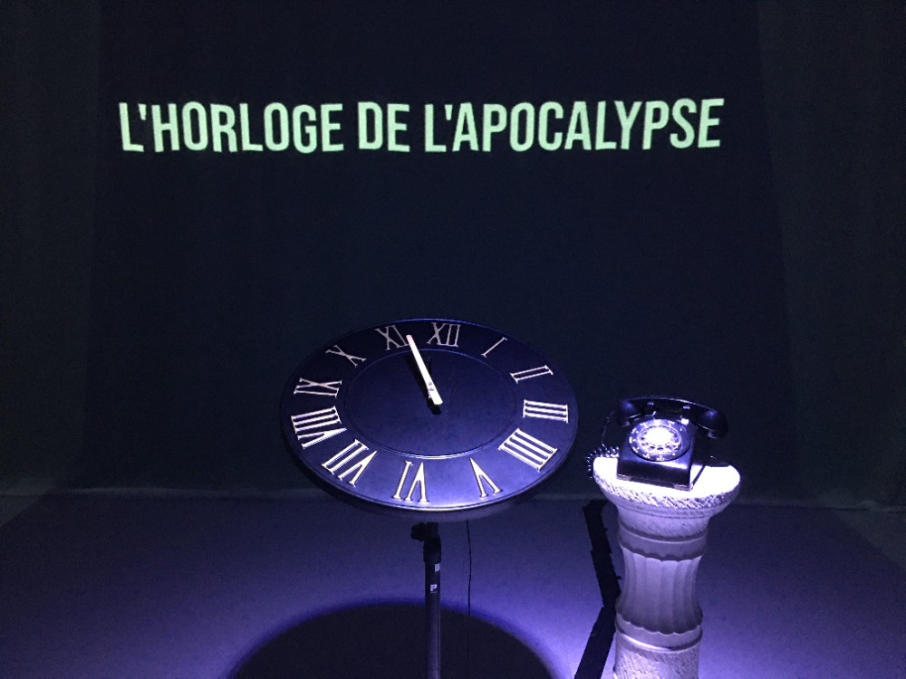

## Titre de l’oeuvre
l’horloge de l’apocalypse

## Nom des artistes
Maxime Sabourin, Louis-Philippe Gravel, Alexis Lacasse, Tristan Girard-Montpetit et Maxime De Falco

## Année de réalisation
2022

## Nom de l’exposition

MOEBIUS

## Lieu de mise en exposition

Petit studio TIM au Collège Montmorency

## Date de visite
23 mars 2022

## Description de l’oeuvre

L’horloge de l’apocalypse représente la ligne du temps de l’humanité. Selon le concept de l’horloge, il est présentement 11 h 58 et il reste 2 minutes avant la fin de l’humanité. À travers ce projet, l’interacteur est invité à contrôler l’horloge grâce aux aiguilles et ainsi manipuler la ligne du temps. Au cours de l’expérience, vous pourrez vivre les différentes époques auxquelles la terre a été exposée. Vous serez exposé aux différents enjeux actuels à travers la projection qui vous entourera et par le fait même vous plongera dans une immersion totale. 

(ce texte provient du résumé fait par l’équipe qui a réalisé l'œuvre sur la page de L’horloge de l’Apocalypse sur le site web de TIM.)

## Explications sur la mise en place de l’oeuvre ou du dispositif

Vu d’ensemble de l’oeuvre lors de l’expérience 

L'œuvre est présentée dans une salle qui est le petit studio, ce pourquoi l'œuvre n’est pas présentée avec les autres œuvres de l’exposition qui elles se retrouvent dans le grand studio. Lorsque l’on entre dans la pièce, on retrouve dans le milieu un trépied qui soutient un horloge et un piédestal romain sur lequel on retrouve un téléphone à roulette. Le téléphone et l’horloge sont chacun reliés à des fils qui sont camouflés sous un ruban qui rend ceux-ci plus sécuritaires et réduit les risques de s’enfarger. Ils sont reliés jusqu’au bord du mur pour aller se connecter ou ils se doivent. Sur chacun des murs de la pièce, on retrouve des rideaux blancs du type filet qui permettent de rendre la projection plus claire. Des hauts-parleurs sont positionnés à quartre endroits différent dans la pièce, ce qui permet de créer une ambiance lorsque les aiguilles changent d'heure.

Lorsque l’on rentre dans la pièce, il y a un message sur le mur du centre ayant les explications et une petite mise en contexte de l'œuvre. Suite aux explications, il faut avancer les aiguilles de l'horloge pour voir le décor et l’ambiance changer. Lorsque l'horloge atteint 12 heure, le téléphone se met à sonner c,est alors qu'un spectateur doit répondre pour qu'une caméra commence à le filmer et projeter l'individu sur le mur central.

# Liste des composantes et techniques de l'oeuvre

- Animations
- Trames sonores

# Liste des éléments nécessaires pour la mise en exposition

- Téléphone à roulette
- Trépied
- Piédestal romain
- Horloge à chiffres romains
- Câbles 
- Cache-fils
- 3 toiles blanches
- 4 haut-parleurs
- 3 projecteurs vidéo lentille ultra wide 0.3
- 3 système d'accrochage
- Projecteur de lumière couleur

# Expérience vécue:
## - Description de mon expérience de l'oeuvre

Dans le carde de notre cours de documentation d'une collection multimédia, nous devions aller observer l'évolution des différentes oeuvres présentées. C'est pourquoi je savais déjà à quoi m'attendre et pourtant cela ne m'a pas empêché d'être étonnamment suprise du travail minutieux de l'équipe qui à fait l'oeuvre. En effet, leur idée était très bonne et l'oeuvre était très intéressante. Lorsque je suis entrée dans la pièce, j'ai tout de suite été désigné pour changer les aiguilles de l'horloge et j'ai trouvé mon expérience très amusante puisque chaque ambiance et décor avait été travaillé avec minutie.

## - ❤️ Ce qui m'a plu

J'ai beaucoup aimé l'animation des différentes époque et le son était très bien fait. En effet, nous pouvions changer l'aiguille à n'importe quel moment et à chaque fois la transition était parfaite et n'avait heureusement pas d'effet négatif sur l'ambiance de l'expérience.

## - 🤔 Aspect que je ne souhaite pas retenir pour mes propres créations ou que je ferais autrement

Je n'ai pas vraiment compris la nécessité de la caméra qui nous projetait sur le mur à la fin de l'expériance, c'est pourquoi je pense qu'il est parfois mieux de garder les projets que nous faisons simple et ne pas nécessairement chercher à rendre cela compliqué à chaque fois, comme dans ce cas avec la caméra.

# Références 

Site Web de TIM

[Lien vers le site web de TIM](https://tim-montmorency.com/2022/projets/L-horloge-de-l-apocalypse/docs/web/index.html)

Github

[Lien vers le Github de l'horloge de l'apocalypse](https://github.com/MALT5/L-horloge-de-l-apocalypse)

# Ordre de prérérence des projects des finissants en TIM après l'exposition MOEBIUS

1. L'horloge de l'apocalypse (projet 5), puisque le projet est très original et regroupe plusieurs éléments du multimédia comme la conception sonore ou bien l'illustration 2D. De plus, il était très bien organisé et nous faisait vivre plusieurs émotions selon l'heure qu'il était.

2. Chère Sasha (projet 1), puisque le temps est utilisé de manière très originale et présente un sujet très touchant. De plus, je trouve le décor est très immersif et c'est quelque chose que j'ai beaucoup aimé.

3. Chronaufrage (projet 4), puisque le sujet était très intéressant et les interractions étaient amusantes. De plus, les dessins étaient très beaux.

4. Jeu temporel (projet 3), puisqu'il est très original et semble amusant pour les utilisateurs. De plus, il y a beaucoup d'éléments en lien avec le multimédia; surtout au niveau de la programmation.

5. 3 minutes (projet 2), puisque la combinaison des deux moyens multimédias n'est pas très bien expliquée et aurait pu être plus justifiable. Il y a aussi eu des problèmes techniques lors de l'exposition ce qui m'a fait remarquer que l'équipe n'était peut-être pas prête à présenté l'oeuvre

6. Distorsion collective (projet 6), puisque je n'ai pas vraiment compris le but du projet ni sont lien avec le temps. Il n'y avait aussi aucun éléments visuel qui nous attirait à aller essayer l'oeuvre, donc celui-ci n'a pas vraiment attiré mon attention.
