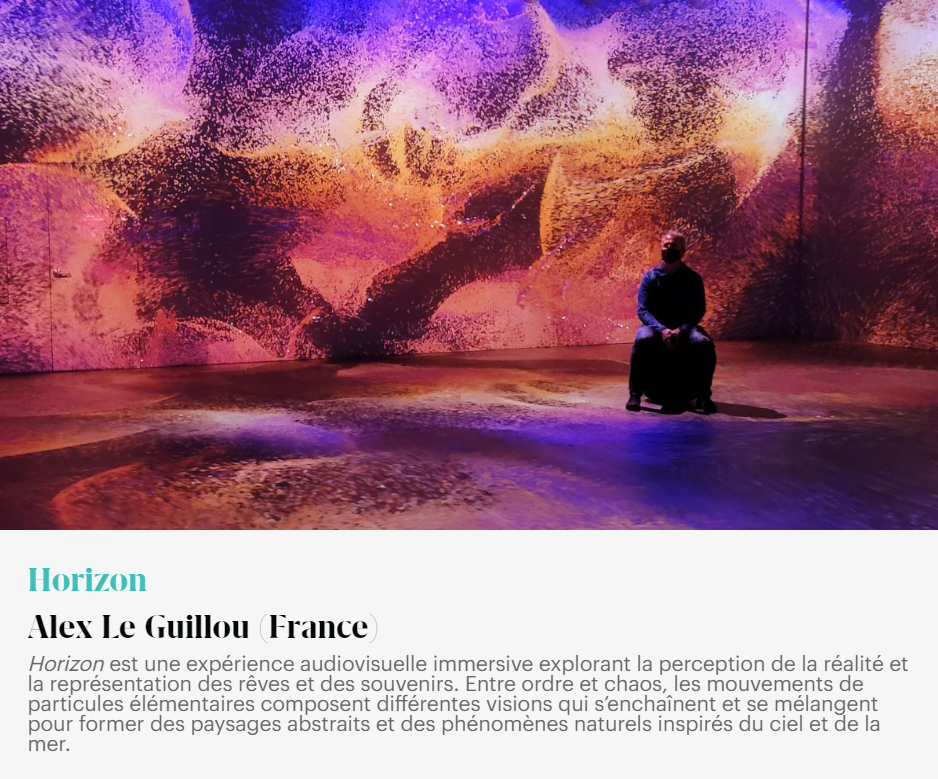
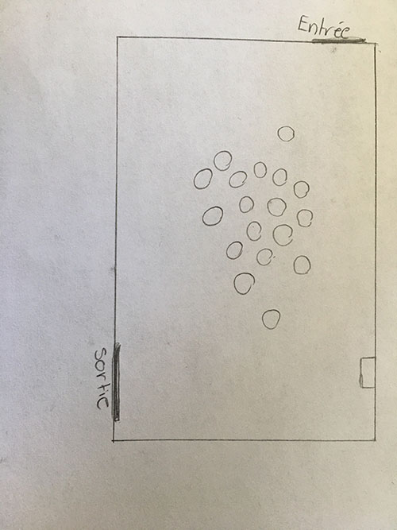
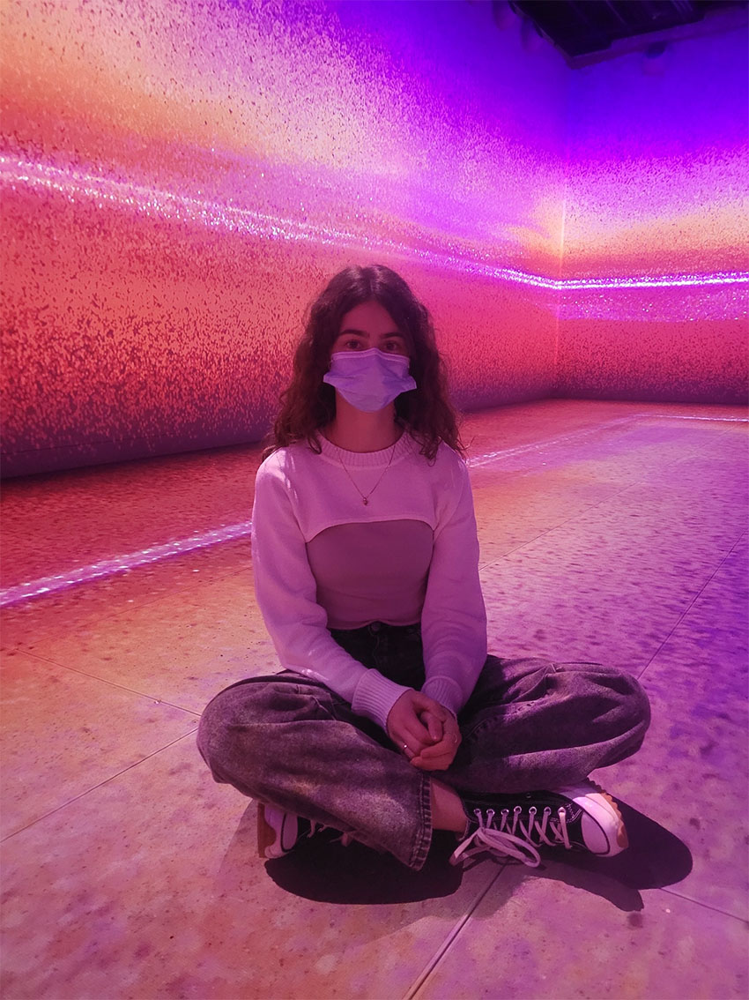

# Titre de l'oeuvre 

Horizon

# Nom des l'artistes

Alex Le Guillou, Jonathan Fitas (musique)

# Année de réalisation

2021

# Nom de l'exposition

RECHARGER/Unwind

# Lieu de mise en exposition

OASIS immersion

# Date de ma visite

16 février 2022

# Description de l'oeuvre

Horizon est une expérience audiovisuelle immersive explorant la perception de la réalité et la représentation des rêves et des souvenirs. Entre ordre et chaos, les mouvements de particules élémentaires composent différentes visions qui s’enchaînent et se mélangent pour former des paysages abstraits et des phénomènes naturels inspirés du ciel et de la mer.

(Ce texte est tiré de la page Web dédiée aux oeuvre présentés sur site d'OASIS immersion)

## Cartel de l'oeuvre 

# Explications sur la mise en espace de l'oeuvre

Lors de mon expérience à OASIS immersion, nous devions nous promener de pièce en pièce pour découvrir les différentes oeuvres qui étaient présentée en boucle. Lors que je suis entrée dans le téléportateur, c'est-à-dire la salle où est présenté l'oeuvre Horizon, il y avait de petits bancs dans le centre de la pièce pour permettre une meilleure expérience aux visiteurs. La pièce où est présenté l'oeuvre Horizon est environ de la même grandeur que la première pièce, portail, mais est presque deux fois plus petite que la troisième pièce, panorama. Au plafond, plusieurs haut-parleurs avec système audio ambiophonique sont accrochés sur le plafond, principalement sur le long des murs pour permettre une meilleure expérience auditive. Les projecteurs au laser sont eux aussi installés au plafond, mais plus au centre pour permettre une meilleure diffusion de la lumière lors des projections.

# Croquis de l'oeuvre

# Liste des composantes et techniques de l'oeuvre

# Liste des éléments nécessaires pour la mise en exposition

# Expérience vécue :

## - Description de mon expérience de l'oeuvre

Lorsque je suis entrée dans la pièce du téléportateur, il y avait des petits bancs au centre de la pièce pour permettre une meilleure expérience aux visiteurs, en étant une expérience immersive, j'ai tout de suite été touché par la musique et les projections qu'il y avait dans la pièce.

murs épais pour pas pollution sonore

- ❤️ Ce qui m'a plu

Il y a beaucoup d'aspects qui m'ont plu lors de mon expérience, dont le type de projection. En effet, il y avait plusieurs types, certaines animations étaient plus réalistes et l'on pouvait apersevoir des objets distincts comme des fleurs ou bien des animaux. Cependant, dans cette oeuvre, ce que l'on voyait ressemblait plus à des points de différentes couleurs qui se déplaçait au rythme de la musique. j'ai aussi beaucoup aimé que la projection suive la musique et le rythme tout a long de l'expérience.

- 🤔 Aspect que je ne souhaite pas retenir pour mes propres créations ou que je ferais autrement

Suite à ma visite il n'y a pas vraiment d'aspect sur les oeuvres que je pourrais retenir afin de ne pas les reproduire. Cependant, il y avait beaucoup de gens ce qui faisait que l'on avait parfois de la difficulté à aprécier l'oeuvre et il manquait même des places pour s'assoir, comme dans la salle téléportation, donc si j'avais pu faire quelque chose autrement, j'aurais probablement fait les pièce plus grande ou bien mieux controler le nombre de gens qui pouvait entrer pour observer les oeuvres.

# Références

Site de l'artiste

[Lien vers le site d'Alex Le Guillou](https://alexleguillou.com/Horizon)

Site d'OASIS immersion

[Lien vers le site d'OASIS immersion](https://oasis.im/)
